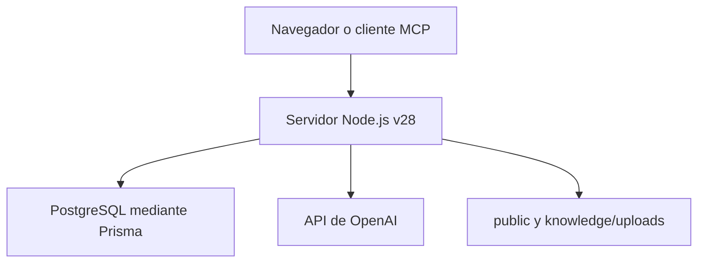

# Aplicación de creación de asignaturas — versión 28

Aplicación web para crear, revisar y aprobar guías didácticas con Node.js,
TypeScript, PostgreSQL, Prisma y la API de OpenAI. Incluye gestión de usuarios,
matrices curriculares, generación semanal, recursos asistidos, imágenes,
documentos institucionales, indicadores y exportación a Word.

Esta copia conserva la lógica funcional de la versión 28. Los cambios añadidos
para la entrega son exclusivamente documentación, ejemplos de configuración y
limpieza del paquete.

## Estado y versión reproducible

- Versión de la aplicación: `1.0.0`.
- Versión funcional del proyecto: `v28`.
- Etiqueta sugerida para esta copia documentada: `v28-docs-1`.
- Rama histórica: `feature/generador-guias-mvp`.
- Requisito del paquete: Node.js `>=24 <25`.
- Base de datos prevista: PostgreSQL 17.

En un servidor estable despliegue `v28-docs-1` después de confirmar la
documentación en Git. Si solamente existe `v28`, puede desplegar esa base
funcional y conservar la documentación por separado. No mueva una etiqueta ya
publicada ni despliegue una rama móvil sin anotar el commit exacto.

## Arquitectura



- El servidor HTTP, la API y el servidor MCP se ejecutan en un solo proceso.
- La interfaz de `public/` se sirve desde el mismo origen.
- PostgreSQL guarda usuarios, proyectos, semanas, revisiones e imágenes
  generadas. Las imágenes se almacenan como bytes en la tabla `GeneratedImage`.
- Los documentos administrativos cargados durante la ejecución también guardan
  un archivo original en `knowledge/uploads/`; esa ruta debe ser persistente.

Consulte [Arquitectura y datos](docs/ARQUITECTURA_Y_DATOS.md) para el detalle.

## Requisitos

- Node.js 24 LTS y npm 11.
- PostgreSQL 17 o un servicio PostgreSQL administrado compatible.
- Git para instalar desde el repositorio.
- Acceso HTTPS para cualquier entorno compartido.
- Un proyecto de OpenAI con facturación, límites y acceso a los modelos
  configurados.
- Almacenamiento persistente para `knowledge/uploads`.

Docker es opcional. El archivo `docker-compose.yml` solamente inicia PostgreSQL
para desarrollo local; la aplicación puede conectarse directamente a una base
local instalada o remota.

## Inicio rápido local con Docker

```bash
git clone URL_DEL_REPOSITORIO
cd app-creacion-asignaturas
git switch --detach v28

cp .env.example .env
docker compose up -d postgres
npm ci
npx prisma generate
npx prisma migrate deploy
```

Antes de inicializar la base, edite `.env` y sustituya
`LOCAL_USER_EMAIL`, `INITIAL_ADMIN_PASSWORD` y `OPENAI_API_KEY`.

Ejecute el `seed` una sola vez:

```bash
npx tsx prisma/seed.ts
```

Después inicie el entorno de desarrollo:

```bash
npm run dev
```

Abra `http://localhost:3000`. Prisma Studio es opcional:

```bash
npx prisma studio
```

## Inicio local sin Docker

1. Cree una base PostgreSQL local o administrada.
2. Copie `.env.example` como `.env`.
3. Reemplace `DATABASE_URL` con la URL de esa base.
4. Ejecute los mismos comandos de instalación, migración y `seed`.

```bash
npm ci
npx prisma generate
npx prisma migrate deploy
npx tsx prisma/seed.ts
npm run dev
```

No apunte Prisma Studio ni un entorno de desarrollo directamente a la base de
producción.

## Construcción y ejecución de producción

```bash
npm ci
npx prisma generate
npm run build
npx prisma migrate deploy
npm start
```

El `seed` no forma parte de cada arranque. Se ejecuta solamente al crear una
instalación limpia. El código actual vuelve a establecer la contraseña del
administrador si se ejecuta otra vez.

## Variables de entorno

| Variable | Obligatoria | Uso |
|---|---:|---|
| `DATABASE_URL` | Sí | Conexión PostgreSQL utilizada por Prisma. |
| `NODE_ENV` | Sí en producción | Use `production` en el servidor. |
| `PORT` | Según plataforma | Puerto HTTP; valor local predeterminado `3000`. |
| `OPENAI_API_KEY` | Para generación | Clave del proyecto de OpenAI; nunca debe llegar al navegador ni a Git. |
| `OPENAI_MODEL` | Recomendable | Modelo de texto; v28 usa `gpt-5.6` por defecto. |
| `OPENAI_IMAGE_MODEL` | Recomendable | Modelo de imágenes; v28 usa históricamente `gpt-image-1`. |
| `MCP_SERVER_NAME` | No | Nombre publicado por el servidor MCP. |
| `MCP_SERVER_VERSION` | No | Versión publicada por el servidor MCP. |
| `LOCAL_USER_EMAIL` | Solo `seed` | Correo del administrador inicial. |
| `INITIAL_ADMIN_PASSWORD` | Solo `seed` | Contraseña inicial; debe ser larga, única y segura. |
| `APP_BASE_URL` | Para recuperación | URL pública del Sistema de Gestión Guía didáctica usada para construir el enlace de restablecimiento. En producción debe ser HTTPS. |
| `SMTP_HOST` | Para recuperación | Servidor SMTP que enviará los correos de recuperación. |
| `SMTP_PORT` | Para recuperación | Puerto SMTP; normalmente `587` con STARTTLS o `465` con TLS implícito. |
| `SMTP_SECURE` | Para recuperación | `true` para TLS implícito (habitualmente puerto 465). |
| `SMTP_STARTTLS` | Para recuperación | `true` para elevar una conexión SMTP a TLS (habitualmente puerto 587). |
| `SMTP_USER` | Según servidor SMTP | Usuario SMTP. Puede dejarse vacío si el relay autorizado no requiere autenticación. |
| `SMTP_PASSWORD` | Según servidor SMTP | Contraseña SMTP; debe permanecer únicamente en secretos del servidor. |
| `SMTP_FROM` | Para recuperación | Remitente de los mensajes, por ejemplo `Sistema de Gestión Guía didáctica <no-reply@institucion.edu>`. |
| `SMTP_HELO_NAME` | No | Nombre enviado por el cliente en `EHLO`; por defecto `gestion-guia.local`. |

La API oficial recomienda mantener las claves en variables del servidor o en un
gestor de secretos, nunca en código ni en el cliente:
<https://developers.openai.com/api/docs/guides/production-best-practices>.

## Verificación mínima

Con la aplicación iniciada:

```bash
curl --fail http://127.0.0.1:3000/health
curl --fail http://127.0.0.1:3000/health/database
```

La primera ruta valida el proceso HTTP y la segunda ejecuta una consulta real a
PostgreSQL. Complete además la lista de aceptación de
[Entrega técnica](docs/ENTREGA_TECNICA.md).

## Documentación de despliegue

1. [Arquitectura y datos](docs/ARQUITECTURA_Y_DATOS.md)
2. [Guía de despliegue](docs/DESPLIEGUE.md)
3. [Base de datos, respaldo y restauración](docs/BASE_DATOS_RESPALDO_RESTAURACION.md)
4. [Operación, seguridad y solución de problemas](docs/OPERACION_SEGURIDAD.md)
5. [Lista de entrega y aceptación](docs/ENTREGA_TECNICA.md)
6. [Bitácora histórica](docs/bitacora.md)

## Advertencia antes de publicar en Internet

La versión 28 compila y su esquema Prisma es válido, pero no debe considerarse
endurecida para exposición pública sin controles adicionales. Algunas rutas de
generación y registro son públicas, no hay limitación de solicitudes y la
auditoría de dependencias del 6 de agosto de 2026 reportó vulnerabilidades
conocidas. Use una red privada, VPN o un proxy de identidad mientras se completa
el endurecimiento descrito en [Operación y seguridad](docs/OPERACION_SEGURIDAD.md).

## Comandos disponibles

```bash
npm run dev     # desarrollo con recarga
npm run build   # compila TypeScript en dist/
npm start       # ejecuta dist/index.js
npm test        # todavía no hay pruebas automatizadas; actualmente termina con error
```

La aceptación de esta versión depende de compilación, validación de Prisma y
pruebas funcionales manuales. Agregar pruebas automatizadas es una tarea
pendiente y debe realizarse en una versión posterior.

## Estructura relevante

```text
app-creacion-asignaturas/
├── docs/                  Documentación y bitácora
├── knowledge/             Fuentes institucionales versionadas
├── prisma/                Esquema, migraciones y seed
├── public/                Interfaz web servida por Node.js
├── src/                   Código TypeScript
├── .env.example           Plantilla sin secretos
├── docker-compose.yml     PostgreSQL local opcional
├── package.json
├── package-lock.json
└── tsconfig.json
```
