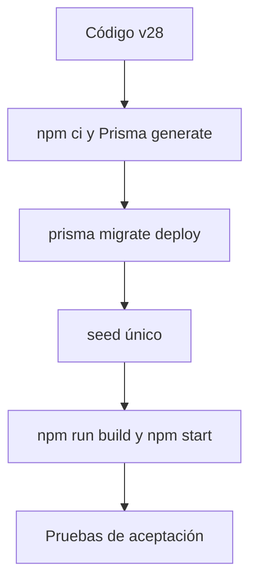

# Arquitectura y datos de la versión 28

## 1. Propósito de este documento

Este documento permite que una persona nueva comprenda qué debe desplegar, qué
datos debe conservar y qué dependencias externas utiliza la aplicación. Fue
elaborado a partir de `src/index.ts`, `prisma/schema.prisma`, las migraciones y
`prisma/seed.ts` de la versión 28.

## 2. Componentes

| Componente | Ubicación | Responsabilidad |
|---|---|---|
| Servidor HTTP | `src/index.ts` | API JSON, autenticación, interfaz web, generación, Word y MCP. |
| Interfaz web | `public/` | HTML, CSS y JavaScript que consume la API del mismo origen. |
| Acceso a datos | `src/db/client.ts` | Instancia de Prisma Client y verificación de conexión. |
| Modelo de datos | `prisma/schema.prisma` | Estructura declarativa de PostgreSQL. |
| Migraciones | `prisma/migrations/` | Historial que crea una base limpia mediante `prisma migrate deploy`. |
| Datos iniciales | `prisma/seed.ts` | Roles, administrador, conocimiento base e indicadores. |
| Conocimiento base | `knowledge/*.txt` | Fuentes institucionales incluidas en Git y cargadas por el `seed`. |
| Documentos cargados | `knowledge/uploads/` | Archivos originales creados desde el panel administrativo. |
| API externa | OpenAI | Generación de semanas, recursos asistidos e imágenes. |

El proceso escucha en `0.0.0.0` y usa `PORT`, por lo que puede ejecutarse detrás
de un proxy inverso o en una plataforma administrada.

## 3. Flujo de una instalación limpia

Una instalación limpia no recupera usuarios, proyectos ni contenidos de otra
base. Para recuperar datos anteriores se debe restaurar un `pg_dump` y la copia
correspondiente de `knowledge/uploads`; en ese flujo no se ejecuta primero el
`seed` ni se crea el esquema con migraciones.

## 4. Persistencia

| Información | PostgreSQL | Sistema de archivos | Debe respaldarse |
|---|---:|---:|---:|
| Usuarios, roles y sesiones | Sí | No | Sí |
| Proyectos, matrices y semanas | Sí | No | Sí |
| Versiones y revisiones | Sí | No | Sí |
| Imágenes generadas | Sí, en `GeneratedImage.imageData` | No | Sí, mediante `pg_dump` |
| Metadatos y Markdown de conocimiento | Sí | No | Sí |
| Originales cargados por administración | Ruta y metadatos | `knowledge/uploads/` | Sí, ambos |
| Fuentes institucionales de fábrica | Copia cargada por `seed` | `knowledge/*.txt` en Git | Sí, mediante Git |
| Código e interfaz | No | Repositorio Git | Sí, tag o commit exacto |

`knowledge/uploads` no puede vivir en un sistema de archivos efímero. En un VPS
debe conservarse fuera de ciclos destructivos de despliegue y tener permisos de
escritura para el usuario del servicio. En Render debe montarse un disco en
`/opt/render/project/src/knowledge/uploads`.

## 5. Grupos del modelo de datos

### Identidad y acceso

- `User`, `Role` y `UserRole`.
- `UserSession`, con tokens almacenados como hash y expiración de ocho horas.
- `AuditLog` para eventos administrativos registrados por la aplicación.

### Oferta y proyectos

- `AcademicPeriod`, `Course` y `TeachingAssignment`.
- `Project`, `Matrix`, `MatrixRow` y `Attachment`.
- `ProjectWeek` y `WeekVersion`.
- `GeneratedImage`, cuyos binarios aumentan directamente el tamaño de la base.

### Conocimiento y reglas

- `GenerationInstruction`.
- `KnowledgeDocument`.
- Los proyectos conservan identificadores de instantáneas para reproducir el
  contexto administrativo usado en la generación.

### Evaluación

- `IndicatorVersion` y `GuideIndicator`.
- `GuideReview` y `GuideReviewItem`.
- Etapas de revisión: `PEER`, `QUALITY` y `DIITEP`.

## 6. Qué crea el seed

`npx tsx prisma/seed.ts` crea o actualiza:

1. Los roles `ADMIN`, `TEACHER`, `REVIEWER`, `QUALITY`, `DIRECTOR` y `DIITEP`.
2. El administrador indicado por `LOCAL_USER_EMAIL`.
3. La contraseña de ese administrador, usando `INITIAL_ADMIN_PASSWORD`.
4. Las fuentes institucionales incluidas en `knowledge/`.
5. El catálogo activo de indicadores si todavía no existe.

El `seed` es parcialmente idempotente, pero siempre genera un nuevo hash y
actualiza la contraseña del administrador. Por eso debe ejecutarse una sola vez
en una base limpia y no como parte de cada reinicio o despliegue.

## 7. Rutas operativas

| Método y ruta | Finalidad | Protección en v28 |
|---|---|---|
| `GET /` | Interfaz web | Pública |
| `GET /health` | Estado del proceso HTTP | Pública |
| `GET /health/database` | Consulta real a PostgreSQL | Pública |
| `POST /api/auth/register` | Autorregistro como profesor | Pública |
| `POST /api/auth/login` | Inicio de sesión | Pública |
| `POST /api/auth/logout` | Cierre de sesión | Cookie de sesión |
| `GET /api/auth/me` | Usuario actual | Devuelve `null` sin sesión |
| `/api/admin/*` | Administración | Sesión y rol `ADMIN`, salvo revisiones delegadas |
| `GET /api/projects` | Proyectos propios | Sesión requerida |
| `GET /api/projects/:id` | Proyecto propio | Sesión y propiedad |
| `POST /api/projects/sync` | Crear o actualizar proyecto | Sesión requerida |
| `POST /api/validate-matrix` | Analizar Excel o CSV | Pública |
| `POST /api/generate-week` | Generar contenido con OpenAI | Pública en v28 |
| `POST /api/generate-visual` | Generar y guardar imagen | Pública en v28 |
| `POST /api/generate-assisted-resource` | Crear recurso de texto | Pública en v28 |
| `GET /api/generated-images/:id` | Servir imagen por UUID | Pública |
| `POST /api/download-word` | Construir DOCX | Pública en v28 |
| `/mcp` | Transporte MCP HTTP | Público en v28 |

Las rutas marcadas como públicas explican por qué esta versión necesita una red
privada, VPN o proxy de identidad antes de exponerse en Internet. El detalle de
riesgos y mitigaciones está en `docs/OPERACION_SEGURIDAD.md`.

## 8. Límites relevantes del código

- El cuerpo JSON completo está limitado a 15 000 000 bytes.
- Una matriz se recibe en base64 y su cadena está limitada a 14 000 000 de
  caracteres; la interfaz describe un archivo aproximado de hasta 10 MB.
- Cada solicitud de generación admite hasta tres adjuntos PDF, DOCX o TXT.
- El servidor no define un tiempo máximo propio para las llamadas a OpenAI; el
  proxy debe permitir solicitudes largas y el monitoreo debe detectar bloqueos.
- El proceso puede escalar con una base compartida, pero los documentos en
  `knowledge/uploads` también requerirían almacenamiento compartido. Con un
  disco local, opere una sola instancia.
- No existe una cola de trabajos: las generaciones se procesan dentro de la
  solicitud HTTP.

## 9. Dependencias y compatibilidad

La compatibilidad reproducible está fijada en `package-lock.json`.

- Node.js 24, exigido por `package.json` mediante `>=24 <25`.
- npm 11 y lockfile versión 3.
- Prisma y Prisma Client 6.19.3.
- PostgreSQL como único proveedor configurado.
- SDK JavaScript de OpenAI 6.49.0.

No cambie versiones durante un despliegue de recuperación. Las actualizaciones
de dependencias deben realizarse en una rama posterior, con compilación, nueva
auditoría y pruebas de aceptación.

## 10. Archivos que no forman parte del despliegue

- `.env` y cualquier secreto.
- `node_modules/`, porque se reconstruye con `npm ci`.
- `dist/`, porque se reconstruye con `npm run build`.
- `knowledge/uploads/`, porque contiene datos operativos y se restaura por otro
  canal.
- Respaldos `.dump`, archivos comprimidos y comprobaciones con datos reales.
- Metadatos `__MACOSX` y `.DS_Store`.
